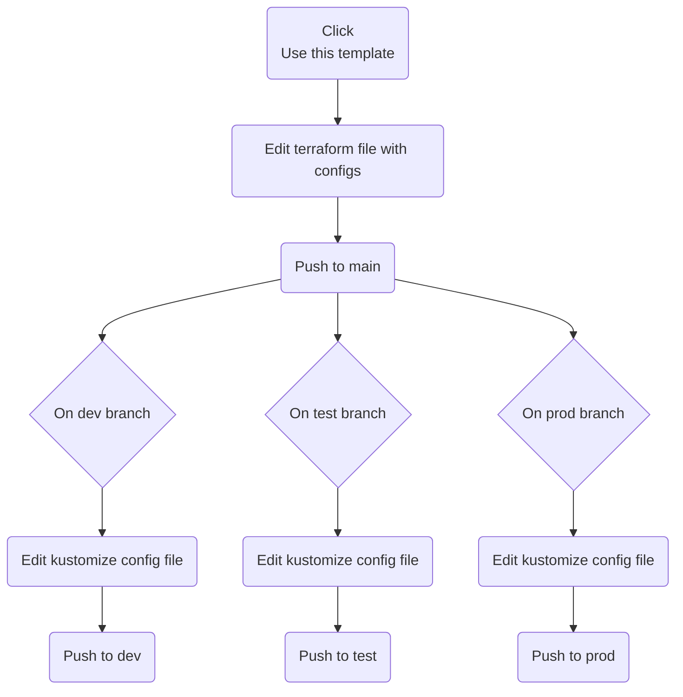

# Open Digital Transformation

## Usage

This is the flow how to deploy a Cluster and it's resources. Each **branch** targets a diffrent namespace isolated by network.
> Make sure to **include all branches** when **creating a new repository**.


> When pushing to **main** the terraform file, the cluster will be created alongside all the cluster level resources (cert-manager, HAProxy, Keycloak, ...).

> When Pushing to **dev/test/pro**, will deploy the resources for the specific environment.


## Preparation Steps:

> Requirements: Domain, kubectl and terraform installed

1. [Create k8s cluster](https://www.digitalocean.com/products/kubernetes)

```
terraform plan

terraform apply
```

2. Connect to cluster

   - [Create Digital Ocen API Key](https://docs.digitalocean.com/reference/api/create-personal-access-token/)
   - [Install doctl](https://docs.digitalocean.com/reference/doctl/how-to/install/)

     - `doctl kubernetes cluster kubeconfig save <API Key>`
     - `kubectl get nodes`

- Create a DNS `A` record for your domain named `*.your_domain` that points to your `Load Balancer IP ADDRESS`
  - `doctl compute domain records create <your_domain> --record-name * --record-type A --record-data <IP ADDRESS>`

# Resources

- Kubeview: `kubectl port-forward svc/kubeview 8080:80 -n kubeview` => `http://localhost:8080/`
- InfluxDb: `kubectl port-forward svc/influxdb 8086:8086 -n influxdb` => `http://localhost:8086/`
- FlowForge: `https://forge.your_domain`

# Demo

Data source: https://weather.pdrivom.dev/?#flow/b7644f0d676bbdfe
Objective: https://www.kaggle.com/datasets/ananthr1/weather-prediction/data

`kubectl get pods --all-namespaces -o json | jq '.items[] | select(.status.reason!=null) | select(.status.reason | contains("Evicted")) | "kubectl delete pods \(.metadata.name) -n \(.metadata.namespace)"' | xargs -n 1 bash -c`

# Security

run:

```
kustomize build . | kube-score score -
```

# Roadmap

## MVP
- [ ] Digitalocean deploy w/ Terraform
- [ ] CLI/... to deploy selected folders with Kustomize
- [ ] Namespaces split dev/test/prod and others on cluster wise (network isolation between envs)
- [ ] Keycloak
- [ ] Operation Center
- [ ] Node-READY
- [x] InfluxDb
- [x] Grafana
- [ ] Mage
- [ ] Data warehouse DB
- [ ] Superset

## v1
- [ ] Prometheus for Cluster monitoring
- [ ] Node-RED Kafka node with schema Registry
- [x] Kafka
- [x] Telegraf (single deploy)
- [ ] Telegrafic (UI interface to deploy Telegraf instances)
- [ ] Digitalocean deploy w/ Terraform (uptime, ... )

## v2
- [ ] More features on Operation Center
- [ ] ML Ops tools
